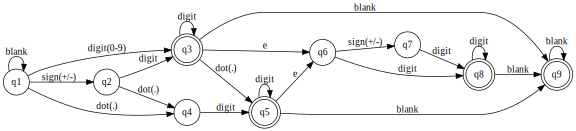

这道题折腾了好久，因为不知道怎样才算作有效的数字。

第一版先将s去掉首尾的空格，然后在一个循环里判断。

需添加的flag有numberSeen, dotSeen, eSeen, numberAfterE。

感觉给的例子还不够完整，然后不断地试错。其正则表达式应为：

    [-+]?([0-9]+(.[0-9]*)?|.[0-9]+)(e[-+]?[0-9]+)?

时间复杂度为O(n)。

submit的结果为:
```
1481 / 1481 test cases passed.
Status: Accepted
Runtime: 96 ms
```

第二版即实现正则表达式，?的用if，+的用n来记录个数并保证其大于0，*的用while。

最后判断i == len(s)。

时间复杂度为O(n)。

submit的结果为:
```
1481 / 1481 test cases passed.
Status: Accepted
Runtime: 80 ms
```

第三版用了DFA(Deterministic Finite Automaton)有限自动机算法。

状态机是字符串模式判定的常用方法。

状态图为:



代码中状态机的序号从0开始。

时间复杂度为O(n)。

submit的结果为:
```
1481 / 1481 test cases passed.
Status: Accepted
Runtime: 76 ms
```
