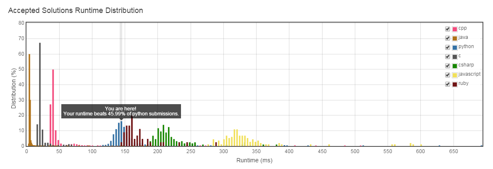

这回试了挺多次的，可见自己想的多不周全。

一开始判断结束条件时出现问题，然后造成输入为[5][5]时，输出为[0]而不是[0,1]

然后还有输入的ListNode的元素个数不相等时出现问题。

最终自己提交了一版，时间复杂度为O(n)。

submit的结果为:
```
1555 / 1555 test cases passed.
Status: Accepted
Runtime: 148 ms
```

看了下其他的Python解法，没找到能极大减少所需时间的。

却惊奇的发现Java解法的耗时比C还要少。


