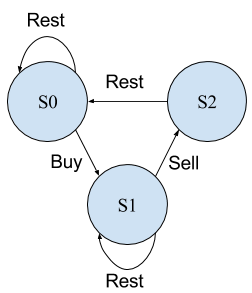

又发现了理解股票买卖问题的解题新思路。或者说是新的理解辅助吧。

因为思路都是DP。但可以借助状态机来理解。

这样真的就明朗起来了。

下面是状态转移图。



其中S0表示Cooldown冷却状态，S1表示hold持有股票状态，S2表示卖出股票状态。

S2为暂态，即不能一直保持在S2状态，经过S2后一定会到达S0状态。

```
s0[i] = max(s0[i - 1], s2[i - 1]); // Stay at s0, or rest from s2
s1[i] = max(s1[i - 1], s0[i - 1] - prices[i]); // Stay at s1, or buy from s0
s2[i] = s1[i - 1] + prices[i]; // Only one way from s1
```

这里用来三个数组，O(n) Space。

因为只与之前的一个相关，所以可以用额外的变量存储，然后转成O(1) Space。

另外需要注意三个值的初始化问题，s0初始化为0，s1初始化为-prices[0]，s2初始化为-2^31。

submit的结果为:
```
212 / 212 test cases passed.
Status: Accepted
Runtime: 76 ms
```
